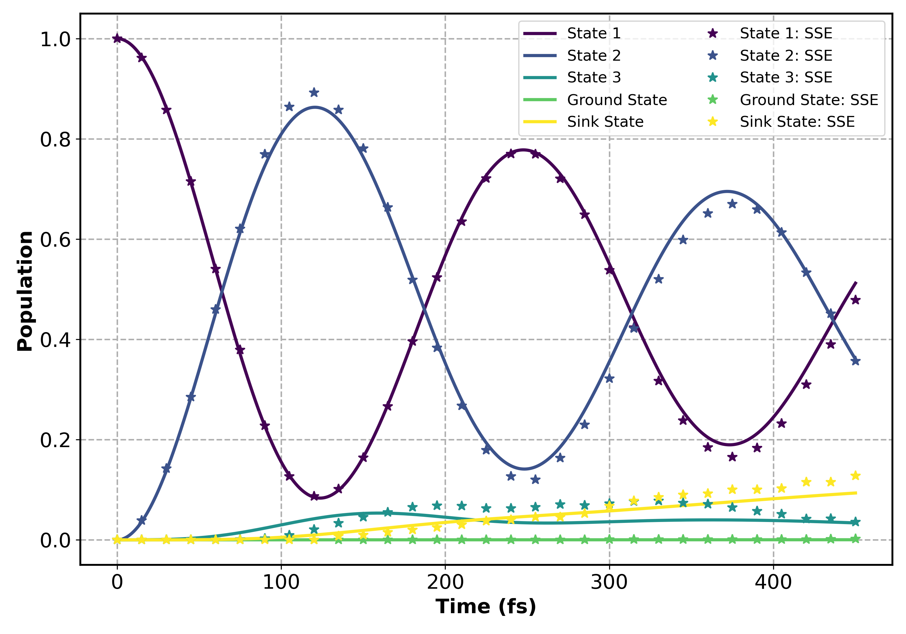

# FMO Trajectory Simulation

This documentation describes how to simulate and visualize the **Fenna–Matthews–Olson (FMO)** complex trajectory using the `Qflux`'s adaptive ansatz variational method framework `QMAD`. The goal is to analyze excitation energy transfer within the FMO system and demonstrate time-dependent propagation of the reduced density matrix.

---


This example of open‑system dynamics is based on the **stochastic Schrödinger equation (SSE)**. SSE simulates **quantum trajectories** on the **same number of qubits** as the system state.

**Features of SSE**
Same qubit count as the system state (no duplication)
Natural for jump/no‑jump dynamics and trajectory parallelization

---

## Stochastic Schrödinger Equation

In the SSE picture, a mixed state (\rho(t)) (usually evolved by a Lindblad master equation) is represented by an **ensemble of pure‑state trajectories** ({,|\psi_c(t)\rangle,}). Each trajectory obeys the stochastic differential equation

$$
\mathrm{d}|\psi_c(t)\rangle = \Big( -i H

* \tfrac{1}{2} \sum_k \big(L_k^\dagger L_k - \langle L_k^\dagger L_k\rangle\big) \Big) |\psi_c(t)\rangle,\mathrm{d}t

- \sum_k \Big( \frac{L_k|\psi_c(t)\rangle}{\langle L_k^\dagger L_k\rangle} - |\psi_c(t)\rangle \Big), \mathrm{d}N_k ,
  $$
  where (\langle\cdot\rangle) denotes the expectation with respect to the current state. The binary increment (\mathrm{d}N_k\in{0,1}) encodes **quantum jumps**.

**Jump probability in a small step** (\mathrm{d}t):
$$
\mathrm{d}p = \sum_{k=1}^K \frac{\langle \psi(t) | L_k^\dagger L_k | \psi(t) \rangle}{\langle \psi(t) | \psi(t) \rangle}, \mathrm{d}t .
$$
If a jump occurs with operator (L_i), update the (unnormalized) state
$$
\tilde{\psi}(t+\mathrm{d}t) = \frac{L_i,\tilde{\psi}(t)}{\langle \tilde{\psi}(t) | L_i^\dagger L_i | \tilde{\psi}(t) \rangle},
$$
and then **normalize** to obtain (|\psi_j(t)\rangle = \tilde{\psi}_j(t)/\langle \tilde{\psi}_j(t)|\tilde{\psi}_j(t)\rangle).

**Ensemble reconstruction** of the density matrix:
$$
\rho(t) = \frac{1}{n} \sum_{j=1}^n |\psi_j(t)\rangle\langle\psi_j(t)| ,
$$
with accuracy improving as (n) (the number of trajectories) increases.


## Implementation Overview

We implement a **variational trajectory algorithm** that alternates deterministic evolution with stochastic jumps. The effective Hamiltonian is split into **Hermitian** and **anti‑Hermitian** parts, the latter capturing dissipative effects from Lindblad operators.

### Effective Hamiltonian Pre‑processing

```python
# effh.py (QMAD)
class EffectiveHamiltonian_class:
    def __init__(self, He, Ha, Llist, LdL):
        self.He = He      # Hermitian part
        self.Ha = Ha      # Anti-Hermitian part (∝ Σ L†L)
        self.Llist = Llist
        self.LdL = LdL    # precomputed L†L terms

def EffectiveHamiltonian(mats, Llist):
    He = sum(mats)
    Ha = 0.0
    LdL = []
    for LL in Llist:
        for L in LL:
            LdL.append(L.conj().T @ L)
            Ha += L.conj().T @ L
    return EffectiveHamiltonian_class(He, 0.5 * Ha, [L for LL in Llist for L in LL], LdL)
```

*Purpose:* build (H_\mathrm{eff} = H_\mathrm{e} - \tfrac{i}{2}\sum_k L_k^\dagger L_k) and cache jump structures.

### Main Trajectory Loop (Deterministic vs. Jump)

```python
# solver.py (QMAD) — core evolution sketch
while t + dt <= tspan[1]:
    He, Ha = H.He, H.Ha
    if np.exp(-Gamma) > q:              # no jump
        one_step(A, He, Ha, dt)         # deterministic update
        psi_ = A.state
        Gamma += 2 * np.real(psi_.conj().T @ Ha @ psi_) * dt
        # (optional) save intermediates
    else:                               # quantum jump
        psi_ = A.state
        weights = np.array([np.real(psi_.conj().T @ LdL @ psi_) for LdL in H.LdL])
        L = H.Llist[np.random.choice(range(len(H.Llist)), p=weights/weights.sum())]
        psi_n = L @ psi_ / np.linalg.norm(L @ psi_)
        # record jump, reset ansatz around new reference
        set_ref(A, psi_n); reset(A)
        Gamma = 0; q = rand()
    if save_state: u_list.append(A.state.copy())
    t += dt
```

*Notes:* After each jump, McLachlan‑based **adaptive ansatz updates** (see below) retune parameters to track the new state efficiently.

### Adaptive Ansatz Updates 

McLachlan’s variational principle selects parameter velocities (\dot{\theta}) to minimize the projection error (see Eqs. analogous to (| (\partial_t + iH)|\psi(\theta)\rangle |) and linear system (M,\dot{\theta}=V)). We employ a **pool of Pauli operators** and greedily append gates that keep this **McLachlan distance** below a threshold, re‑optimizing after jumps.

---

## Parallel Trajectories

Trajectories are **independent** and run trivially in parallel.

```python
from multiprocessing import Pool

def run_trajectories(num_trajectory, H, ansatz, tf, dt):
    param_list = [(H, ansatz, tf, dt) for _ in range(num_trajectory)]
    with Pool() as pool:
        results = pool.starmap(solve_avq_trajectory, param_list)
    return results
```


---

## FMO Complex: SSE Trajectory Simulation

Here we revisit the **Fenna–Matthews–Olson (FMO)** complex, but now simulate **stochastic trajectories** with a compact state representation. We work with NumPy arrays and **pad** objects to powers of two for qubit compatibility (e.g., (5\times5\to8\times8)).

### Model Setup (NumPy, padded)

```python
# Hamiltonian (5×5) → pad to 8×8
H = [
    [0, 0, 0, 0, 0],
    [0, 0.0267, -0.0129, 0.000632, 0],
    [0, -0.0129, 0.0273, 0.00404, 0],
    [0, 0.000632, 0.00404, 0, 0],
    [0, 0, 0, 0, 0],
]
H_fmo = np.pad(H, ((0, 3), (0, 3)), mode='constant')

# Lindblad operators (α, β, γ) and padding
alpha, beta, gamma = 3e-3, 5e-7, 6.28e-3
Llist_f = [np.diag([0]*i + [np.sqrt(alpha)] + [0]*(4-i)) for i in range(1,4)]
Llist_f += [np.array([[np.sqrt(beta) if (i==0 and j==k) else 0 for j in range(5)] for i in range(5)])
            for k in range(1,4)]
L_tmp = np.zeros((5,5)); L_tmp[4,3] = np.sqrt(gamma); Llist_f.append(L_tmp)
Llist_f_padded = [np.pad(M, ((0,3),(0,3)), mode='constant') for M in Llist_f]

# Initial state |1> in the padded 8‑dim space
u0 = np.zeros(8, dtype=np.complex_); u0_fmo = u0.copy(); u0_fmo[1] = 1
```

### Run Trajectories

```python
from qmad.solver import solve_avq_trajectory
from qmad.effh   import EffectiveHamiltonian
from qmad.ansatz import Ansatz

if __name__ == "__main__":
    tf, dt = 450, 5
    num_trajectory = 400
    H = EffectiveHamiltonian([H_fmo], [Llist_f_padded])
    ansatz = Ansatz(u0_fmo, relrcut=1e-5)
    results = run_trajectories(num_trajectory, H, ansatz, tf, dt)
```

### Post‑processing & Populations

Compute average populations of selected basis states and compare against **QuTiP** reference results.

```python
# Diagonal projectors for populations in the padded basis
Mexp_f = [
    np.diag([0,1,0,0,0,0,0,0]),
    np.diag([0,0,1,0,0,0,0,0]),
    np.diag([0,0,0,1,0,0,0,0]),
    np.diag([1,0,0,0,0,0,0,0]),
    np.diag([0,0,0,0,1,0,0,0]),
]

avg = [None]*len(Mexp_f)
for j in range(num_trajectory):
    for k, M in enumerate(Mexp_f):
        ev = []
        for psi in results[j].psi:                      # trajectory states
            rho = np.outer(psi, psi.conj())
            ev.append(np.trace(rho @ M).real)           # population
        avg[k] = np.array(ev) if avg[k] is None else (avg[k] + np.array(ev))

avg = [a/num_trajectory for a in avg]
# time in results[0].t
```



*Observation:* With suitable (\Delta t), trajectory count, ansatz pool, and McLachlan threshold, SSE trajectories **closely track** QuTiP’s numerically exact curves.

---

## Adaptive Updates After Jumps (Brief)

After each detected jump, we (i) reset the ansatz reference to the post‑jump state, (ii) **re‑select** operators from the pool, and (iii) **re‑tune** parameters via the McLachlan linear system. This keeps the variational circuit compact while maintaining accuracy under noise.

---

## Summary

* **SSE** avoids qubit doubling and non‑local Liouvillians, ideal for **NISQ** implementations.
* We decomposed an **effective Hamiltonian**, evolved **quantum trajectories** with deterministic and jump segments, and averaged to reconstruct (\rho(t)).
* On the **FMO complex**, SSE trajectories reproduce **population dynamics** in strong agreement with QuTiP baselines.


---

## References & Links

* Y. Chen *et al.*, *Adaptive variational quantum dynamics for open systems* (2024).
* Shivpuje et al., Designing Variational Ansatz for Quantum-Enabled Simulation of Non-Unitary Dynamical Evolution — An Excursion into Dicke Superradiance, Adv. Quantum Technol. (2024), https://doi.org/10.1002/qute.202400088

* **Code:** QMAD repository: `qmad/solver.py`, `qmad/effh.py`, example notebooks: `examples/trajectory_FMO*.ipynb`.
