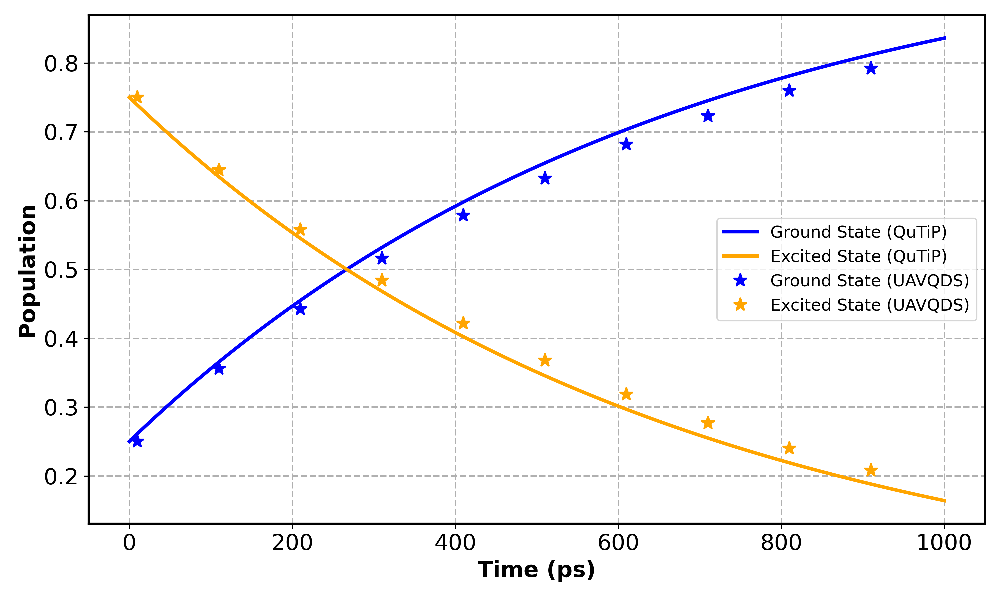
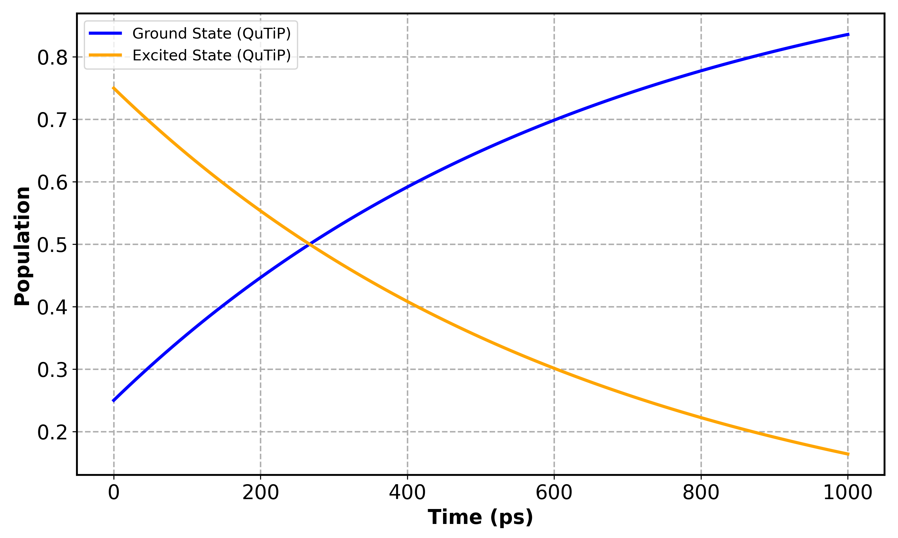
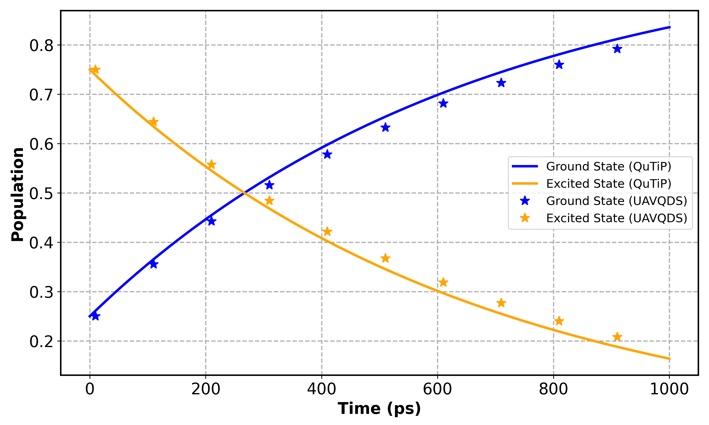

# Amplitude Damping using vectorized variational

This page focuses on the **example**: amplitude damping using the **vectorized variational** method with an **unrestricted adaptive** ansatz. The amplitude damping model describes energy loss from an excited quantum state to a lower-energy state (e.g., spontaneous emission). Here, we simulate this process using:

* The **vectorized representation** of the density matrix.
* The **adaptive variational ansatz**, which grows automatically when accuracy drops.
* A **single-qubit system** undergoing amplitude damping with decay rate (\gamma = 1.52 \times 10^9 \text{ s}^{-1}).


---

## Unrestricted Adaptive Procedure — Vectorized Amplitude Damping (UAVQDS)

This section demonstrates the **unrestricted adaptive variational quantum dynamics (UAVQDS)** method using the **vectorized amplitude damping** model. The example illustrates how to set up the simulation, run it with adaptive variational updates, and compare the results against numerically exact QuTiP benchmarks.

---

## 2. Importing Libraries and Defining Operators

We first import the required modules from the QMAD package and standard Python libraries.

```python
import numpy as np
import matplotlib.pyplot as plt

from qmad.solver import solve_avq_vect
from qmad.effh import VectorizedEffectiveHamiltonian
from qmad.ansatzVect import Ansatz
```

Define Pauli matrices and ladder operators, which will form the building blocks for the amplitude damping process.

```python
sx = np.array([[0, 1], [1, 0]])
sy = np.array([[0, -1j], [1j, 0]])
sp = (sx + 1j * sy) / 2  # raising operator
Id = np.eye(2, dtype=np.complex128)
```

---

## 3. Setting Simulation Parameters

We now define simulation parameters such as total time (`tf`), time step (`dt`), and damping rate (`gamma`). These match typical amplitude damping timescales for a single qubit.

```python
tf = 1000e-12   # 1 ns
dt = 1000e-13   # 0.1 ns
gamma = 1.52e9  # decay rate in s^-1
```

The system Hamiltonian is taken as identity since this model focuses on dissipation rather than coherent evolution.

```python
H_base = np.eye(2, dtype=np.complex128)
```

---

## 4. Constructing the Vectorized Effective Hamiltonian

The vectorized formalism rewrites the Lindblad master equation as a linear equation acting on a vectorized density matrix. The function below constructs the corresponding **effective Hamiltonian** used in the variational evolution.

```python
H_vec = VectorizedEffectiveHamiltonian(H_base, gamma, sp)
```

This automatically builds the dissipative superoperator terms associated with the amplitude damping collapse operator.

---

## 5. Initial State and Ansatz Setup

We initialize the quantum state and define an **unrestricted adaptive ansatz**. The ansatz adjusts its depth automatically based on the residual norm computed during evolution.

```python
u0 = np.array([1/2, np.sqrt(3)/2], dtype=np.complex128)
u0 /= np.linalg.norm(u0)
ansatz = Ansatz(u0, relrcut=1e-6)
```

The `relrcut` parameter determines the sensitivity of adaptive growth: smaller values increase precision but require deeper circuits.

---

## 6. Running the UAVQDS Simulation

We now evolve the system using the adaptive variational solver `solve_avq_vect`. The function returns time steps and density matrices over the full trajectory.

```python
res = solve_avq_vect(H_vec, ansatz, [0, tf], dt)
```

Extract ground and excited state populations from the diagonal elements of the resulting density matrices.

```python
excited = [res.u[i][1, 1].real for i in range(len(res.u))]
ground  = [res.u[i][0, 0].real for i in range(len(res.u))]
times   = np.arange(0, tf + 1e-30, dt)
```

---

## 7. Visualizing UAVQDS Populations

We can now plot the populations of the ground and excited states as functions of time.

```python
plt.plot(times*1e12, ground,  label='Ground (UAVQDS)')
plt.plot(times*1e12, excited, label='Excited (UAVQDS)')
plt.xlabel('Time (ps)')
plt.ylabel('Population')
plt.legend()
plt.tight_layout()
plt.show()
```



---

## 8. Reference Calculation using QuTiP

To validate the UAVQDS results, we compute a reference solution using **QuTiP’s master equation solver (`mesolve`)**.

```python
from qutip import mesolve, Qobj, basis

sp = Qobj(sp)
H  = Qobj(np.eye(2, dtype=np.complex128))

# Time grid matches the UAVQDS simulation
times = np.arange(0, tf, dt)

# Define damping operator and initial state
gamma = 1.52e9
psi0 = Qobj(u0)
rho0 = psi0 * psi0.dag()
c_ops = [np.sqrt(gamma) * sp]

# Projectors for populations
proj_g = basis(2,0)*basis(2,0).dag()
proj_e = basis(2,1)*basis(2,1).dag()

res_qutip = mesolve(H, rho0, times, c_ops, [proj_g, proj_e])
G_q, E_q = res_qutip.expect[0], res_qutip.expect[1]
```

Plot QuTiP results for direct comparison.

```python
plt.plot(times*1e12, G_q, label='Ground (QuTiP)')
plt.plot(times*1e12, E_q, label='Excited (QuTiP)')
plt.xlabel('Time (ps)')
plt.ylabel('Population')
plt.legend()
plt.tight_layout()
plt.show()
```



---

## 9. Combined Comparison Plot

Overlay UAVQDS and QuTiP population curves for a unified view.

```python
plt.figure(figsize=(8,5))

# QuTiP baseline (solid lines)
plt.plot(times*1e12, G_q, label='Ground (QuTiP)')
plt.plot(times*1e12, E_q, label='Excited (QuTiP)')

# UAVQDS sampled markers
step = max(1, len(times)//10)
plt.plot(times[::step]*1e12, ground[::step],  '*', label='Ground (UAVQDS)')
plt.plot(times[::step]*1e12, excited[::step], '*', label='Excited (UAVQDS)')

plt.xlabel('Time (ps)')
plt.ylabel('Population')
plt.legend()
plt.grid(True, ls='--', lw=1.2)
plt.tight_layout()
plt.show()
```




---

## 12. References

* Chen *et al.*, *Adaptive Variational Quantum Dynamics for Open Systems* (2024).
* Shivpuje et al., Designing Variational Ansatz for Quantum-Enabled Simulation of Non-Unitary Dynamical Evolution — An Excursion into Dicke Superradiance, Adv. Quantum Technol. (2024), https://doi.org/10.1002/qute.202400088